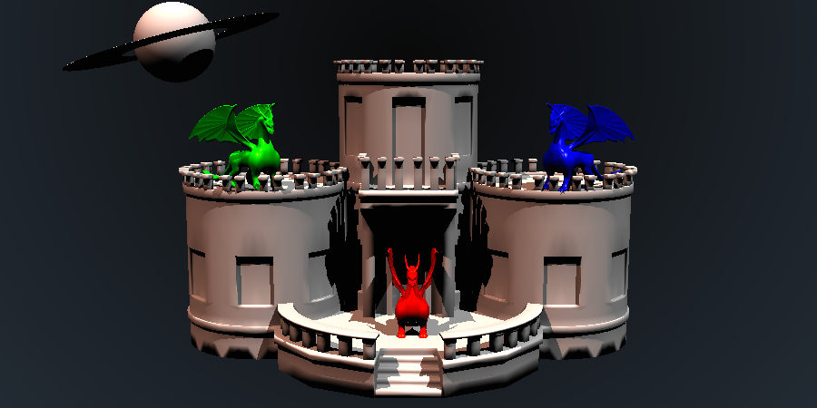

# (TARget) - This A RaytracinG projEcT

This is a simple library for computer graphics applications, which uses xml as description scene formats and was implemented with C++.



## Usage

<details><summary> The instructions below shows how to compile and execute the project.</summary>

```shell
mkdir build
cd build
cmake ..
make
cd ..
./bin/target [file_name_of_descriptor] [path_to_save]
```

</details>

## Doxygen

For more details, see the [reference](https://vinihcampos.github.io/target/).

## Features

- [ ] Backgrounds
    - [x] Solid
    - [x] Bilinear gradient
    - [ ] Texture
- [ ] Camera
    - [x] Size
    - [x] Orthographic
    - [x] Perspective
    - [ ] Oblique versions of orthographic and perspective
- [x] Integrators
    - [x] Flat
    - [x] Depth map
    - [x] Normal map
    - [x] Blinn Phong (with hard shadow)
- [x] Objects
    - [x] Spheres
    - [x] Triangle meshes
- [ ] Accelerators
    - [x] BVH
    - [ ] KDTree
- [x] Geometric transformations

## Author

[<br /><sub>Vinicius Campos</sub>](http://lattes.cnpq.br/4806707968253342)<br />[👀](https://github.com/Vinihcampos/target/commits?author=Vinihcampos)
| :---: | 

## License

This project is licensed under the MIT License - see the [LICENSE.md](LICENSE) file for details
